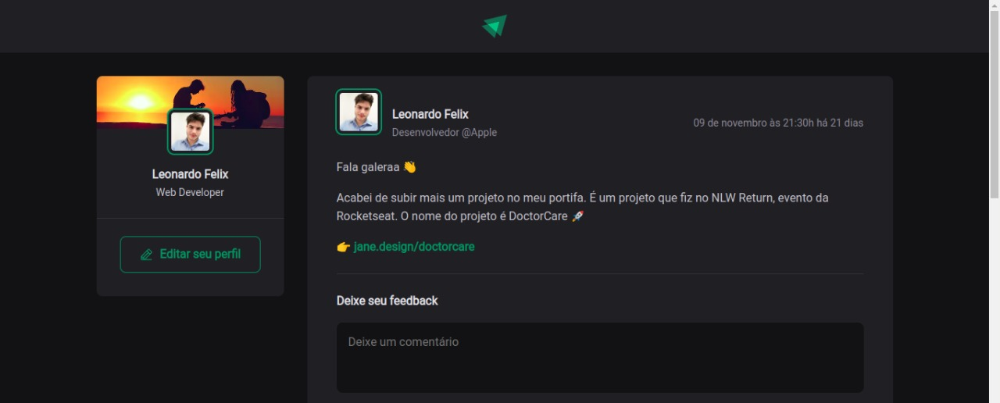
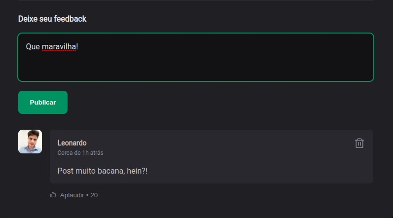
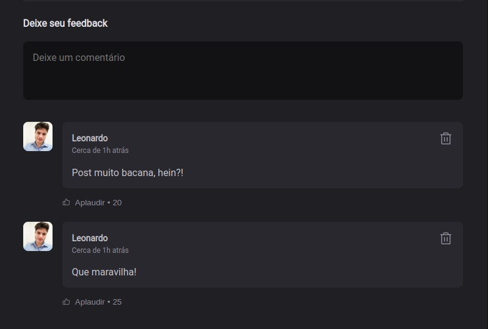

# Project

It simulates a social media, when you can see other people comments and give a thumbs up tho their comments or even answer then.
And you can remove your comment and thumbs up too

## Screens








## Technologies
React application with Vite and Typescript

## Run this project

```bash
# clone repository
git clone https://github.com/Lfelix885/mySocialMedia.git

# enter project folder
cd 01-fundamentos-reactjs-ts

# install dependencies
npm install

# run project
yarn dev
```

## Author
Leonardo Felix

[linkedin](https://www.linkedin.com/in/leonardo-felix-10910a157/)
